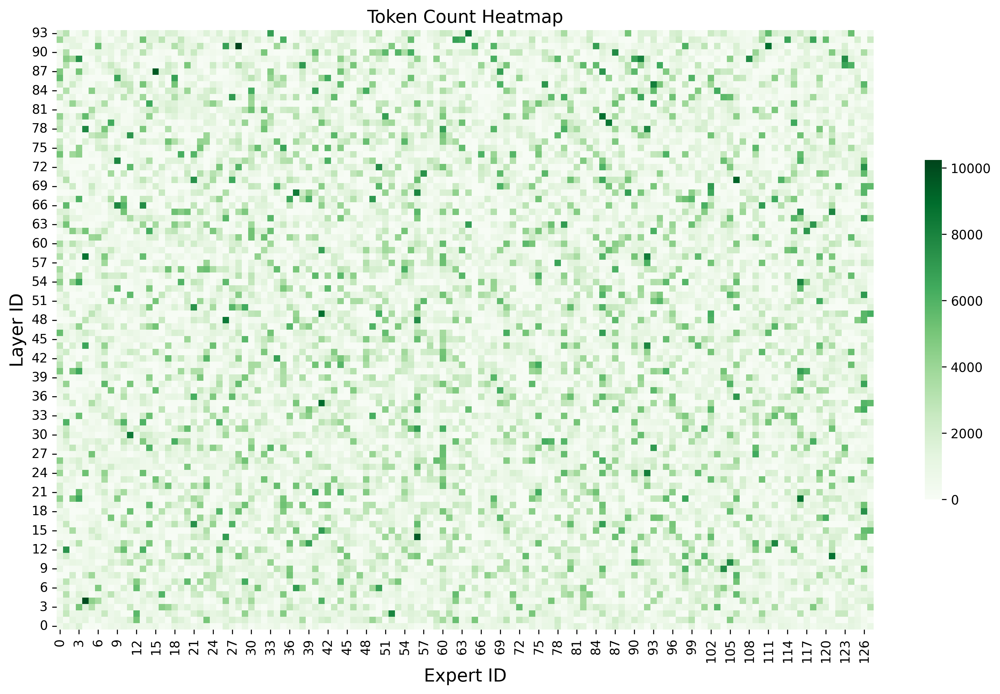
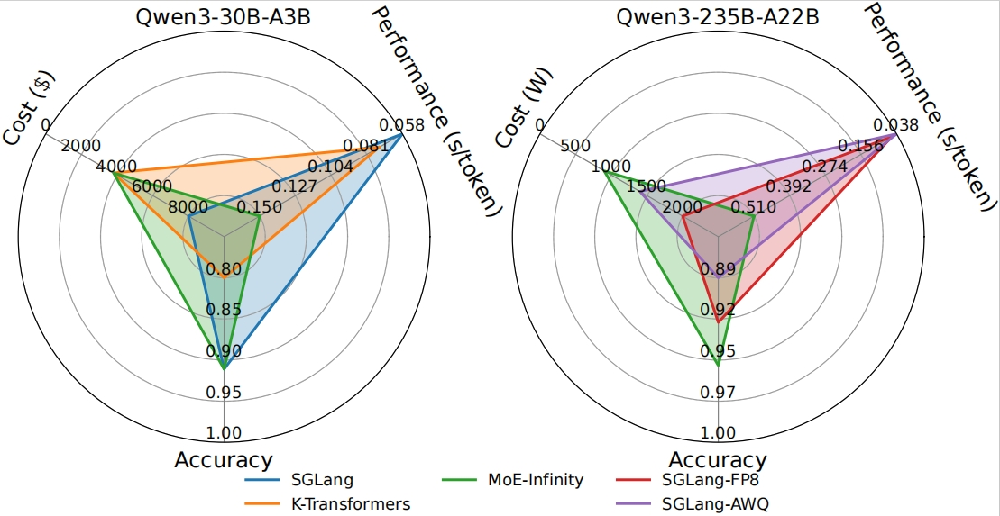
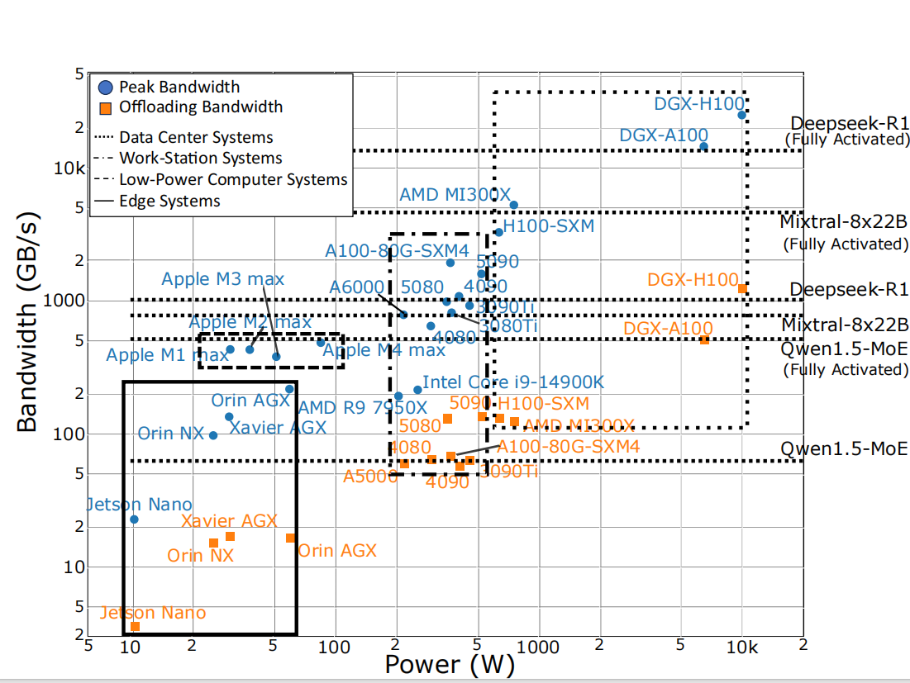

Check out the configuration reference at https://huggingface.co/docs/hub/spaces-config-reference

Current leaderboard is at https://huggingface.co/spaces/sparse-generative-ai/open-moe-llm-leaderboard. It is still under developing! Stay tuned!

# Contributing to Open-MOE-LLM-Leaderboard

Thank you for your interest in contributing to the Open-MOE-LLM-Leaderboard project! We welcome contributions from everyone. Below you'll find guidance on how to set up your development environment, understand our architecture, and contribute effectively. If you have any questions or wish to discuss your contributions, please reach out to Yinsicheng Jiang or Yao Fu via email at [ysc.jiang@ed.ac.uk](mailto:ysc.jiang@ed.ac.uk) or [Y.Fu@ed.ac.uk](mailto:y.fu@ed.ac.uk).

## What We're Looking For in Contributions

We are looking for contributions in several key areas to enhance the Open-MOE-LLM-Leaderboard project:

1. **General Bug Fixes/Reports**: We welcome reports of any bugs found in the frontend interface or backend, as well as fixes for these issues.

2. **Adding New Tasks (Benchmark Datasets)**: If you have ideas for new benchmark datasets that could be added, your contributions would be greatly appreciated.

3. **Supporting New Inference Frameworks**: Expanding our project to support new inference frameworks is crucial for our growth. If you can contribute in this area, please reach out.

4. **Testing More Models**: To make our leaderboard as comprehensive as possible, we need to test a wide range of models. Contributions in this area are highly valuable.

Documentation is currently of lower priority, but if you have thoughts or suggestions, please feel free to raise them.

Your contributions are crucial to the success and improvement of the Open-MOE-LLM-Leaderboard project. We look forward to collaborating with you.


## Development Setup

To start contributing, set up your development environment as follows:

```bash
conda create -n leaderboard python=3.10
conda activate leaderboard
pip install -r requirements.txt
pip install -i https://test.pypi.org/simple/ --extra-index-url https://pypi.org/simple/ moe-infinity
pip install pydantic==2.6.4 # Resolves a dependency conflict with moe-infinity
python -m spacy download en # Required for selfcheckgpt

# Install vLLM (only support up to v0.8.4)
pip install vllm==0.8.4

# Install SGLang
git clone -b v0.4.6.post4 https://github.com/sgl-project/sglang.git
cd sglang
pip install --upgrade pip
pip install -e "python[all]"
```

if you encounter similar conflicts:
```bash
ERROR: pip's dependency resolver does not currently take into account all the packages that are installed. This behaviour is the source of the following dependency conflicts.
moe-infinity 0.0.1.dev20250323174701 requires numpy==1.22.4, but you have numpy 1.26.0 which is incompatible.
moe-infinity 0.0.1.dev20250323174701 requires pyarrow==12.0.0, but you have pyarrow 20.0.0 which is incompatible.
moe-infinity 0.0.1.dev20250323174701 requires pydantic==1.10.12, but you have pydantic 2.10.0 which is incompatible.
moe-infinity 0.0.1.dev20250323174701 requires transformers<4.47,>=4.37.1, but you have transformers 4.51.1 which is incompatible.
```
At present, they will not affect anything and you can ignore them.
## Architecture Overview

The Open-MOE-LLM-Leaderboard project uses the following architecture:

- **User Interface (Gradio)** ->upload-> **HuggingFace Dataset (Request)** ->download-> **Backend GPU Server** ->upload-> **HuggingFace Dataset (Result)** ->download-> **User Interface (Gradio)**

In brief:
1. Users submit model benchmarking requests through the Gradio interface ([app.py](./app.py)). These requests are then recorded in a HuggingFace dataset ([sparse-generative-ai/requests](https://huggingface.co/datasets/sparse-generative-ai/requests)).
2. The backend ([backend-cli.py](./backend-cli.py)), running on a GPU server, processes these requests, performs the benchmarking tasks, and uploads the results to another HuggingFace dataset ([sparse-generative-ai/results](https://huggingface.co/datasets/sparse-generative-ai/results)).
3. Finally, the Gradio interface retrieves and displays these results to the users.

# Quick Start
## Profiling Expert Activation
Script is in `record_experts.py`.
Quickly run by:
```bash
python record_experts.py --model Qwen/Qwen3-235B-A22B --batch_size 16 --task MATH
```

If you would like to run recording on multi-node, please use `record_experts_multi_node.py` which is based on Deepspeed.
Here is an example:
```bash
# On you master node
deepspeed --num_gpus 8 \
          --num_nodes 2 \
          --node_rank 0 \
          --master_addr <YOUR MASTER NODE IP> \
          --master_port 29500 \
          record_experts_multi_node.py.py \
          --model_name Qwen/Qwen3-235B-A22B \
          --batch_size 1 \
          --task MATH

# On another worker node
deepspeed --num_gpus 8 \
          --num_nodes 2 \
          --node_rank 1 \
          --master_addr <YOUR MASTER NODE IP> \
          --master_port 29500 \
          record_experts_multi_node.py \
          --model_name Qwen/Qwen3-235B-A22B \
          --batch_size 1 \
          --task MATH
```

The result will be in `activation_profilling_results/`
```csv
dataset,batch_size,average_activated_experts
MATH,16,57.74534901439277
```

And there will be expert info recorded for each layer, stored in `activation_profiling_expert_count`

We also provide you a tool to draw the heatmap of the activation of each expert in each layer. Quickly run:
```bash
python plot_drawer/expert_distribution.py --csv_file /path/to/xx_expert_counts.csv --output /path/to/dir
```

The result heatmap is like (batch size 16, MATH dataset, Qwen3-235B-A22B):


To run the evaluation, if you would like to choose vLLM as the backend, you can do:
```
VLLM_WORKER_MULTIPROC_METHOD=spawn CUDA_VISIBLE_DEVICES=0,1,2,3 python backend-cli.py  --debug \
                                                --task arena_hard \
                                                --model mistralai/Mixtral-8x7B-Instruct-v0.1 \
                                                --precision bfloat16 \
                                                --inference-framework vllm_moe \
                                                --gpu-type NVIDIA-RTX-A6000-48GB \
                                                --batch_size 16 \
                                                --activation_profile_path /path/to/activation_profiling_results \
                                                --tensor_parallel_size 4
```

We current only stably support SGLang, vLLM, Huggingface Transformers, MoE-Infinity and Accelerator. We are working on adding more systems like K-Transformers and MoE-Gen. Stay tuned!
## Running the Gradio Interface

To launch the Gradio interface, execute:

```bash
python app.py
```

Then, open your browser and navigate to http://127.0.0.1:7860.

## Running the Backend

To start the backend process, use:

```bash
python backend-cli.py --debug
```

For additional details, please consult the [backend-cli.py](./backend-cli.py) script.

## Draw CAP Radar Diagram
Prepare a YAML file:
```python
import yaml

# Generate a template YAML configuration for the radar plot
config = {
    'model_name': 'Qwen3-30B-A3B',
    'axis_labels': ['Performance (s/token)', 'Cost ($)', 'Accuracy'],
    'baseline': 20,
    'ticks': [0, 2000, 4000, 6000, 8000, 10000],
    'data': {
        'SGLang': {'TPOT': 0.058, 'Cost': 8920, 'Accuracy': 0.911},
        'K-Transformers': {'TPOT': 0.073, 'Cost': 3800, 'Accuracy': 0.800},
        'MoE-Infinity': {'TPOT': 0.15, 'Cost': 3800, 'Accuracy': 0.911}
    }
}

# Save the YAML config file
config_path = "/path/to/radar_config.yaml"
with open(config_path, 'w') as file:
    yaml.dump(config, file)
```
Then draw a plot:
```bash
python plot_drawer/draw_radar.py /path/to/radar_config.yaml
```
Radar example: 


---

## Current MoE System Benchmarking



We look forward to your contributions and are here to help guide you through the process. Thank you for supporting the Open-MOE-LLM-Leaderboard project!

## Citation
```
@misc{moe-cap,
      title={MoE-CAP: Benchmarking Cost, Accuracy and Performance of Sparse Mixture-of-Experts Systems}, 
      author={Yinsicheng Jiang and Yao Fu and Yeqi Huang and Ping Nie and Zhan Lu and Leyang Xue and Congjie He and Man-Kit Sit and Jilong Xue and Li Dong and Ziming Miao and Dayou Du and Tairan Xu and Kai Zou and Edoardo Ponti and Luo Mai},
      year={2025},
      eprint={2412.07067},
      archivePrefix={arXiv},
      primaryClass={cs.LG},
      url={https://arxiv.org/abs/2412.07067}, 
}
```
